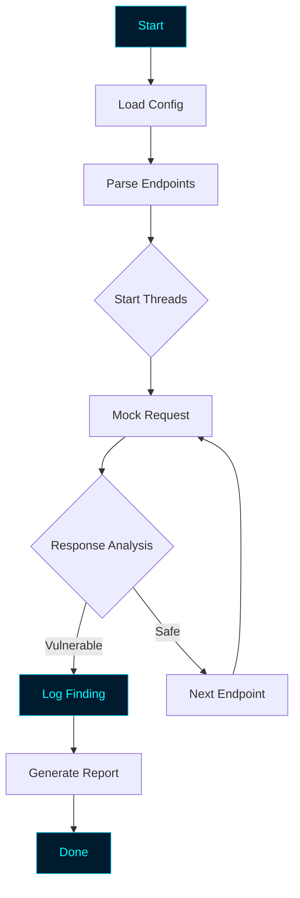

# ZeroStrike
<!-- ═══════════════════════════════════════════════════════════════════════ -->
<!--                        ZEROSTRIKE - README.md                           -->
<!--              Professional Hacker-Style Documentation                    -->
<!-- ═══════════════════════════════════════════════════════════════════════ -->

<div align="center">

<!-- Animated Header Banner -->


<!-- Typing Animation -->


<br>

<!-- Status Badges -->
<p>


</p>

<p>


</p>

<br>

<!-- Matrix Rain GIF -->


</div>

---

<div align="center">

```ascii
███████╗███████╗██████╗  ██████╗ ███████╗████████╗██████╗ ██╗██╗  ██╗███████╗
╚══███╔╝██╔════╝██╔══██╗██╔═══██╗██╔════╝╚══██╔══╝██╔══██╗██║██║ ██╔╝██╔════╝
  ███╔╝ █████╗  ██████╔╝██║   ██║███████╗   ██║   ██████╔╝██║█████╔╝ █████╗  
 ███╔╝  ██╔══╝  ██╔══██╗██║   ██║╚════██║   ██║   ██╔══██╗██║██╔═██╗ ██╔══╝  
███████╗███████╗██║  ██║╚██████╔╝███████║   ██║   ██║  ██║██║██║  ██╗███████╗
╚══════╝╚══════╝╚═╝  ╚═╝ ╚═════╝ ╚══════╝   ╚═╝   ╚═╝  ╚═╝╚═╝╚═╝  ╚═╝╚══════╝

                    [ Strike | Scan | Secure ]
```

</div>

---

## ⚠️ Legal Disclaimer

<div align="center">

```
╔══════════════════════════════════════════════════════════════════════╗
║                                                                      ║
║   ZEROSTRIKE is a security simulation and reconnaissance tool        ║
║   built for EDUCATIONAL and AUTHORIZED testing purposes only.        ║
║                                                                      ║
║   ▸ Use ONLY on targets you have permission to test.                 ║
║   ▸ Unauthorized scanning is ILLEGAL.                                ║
║   ▸ Always follow the bug bounty program's scope and rules.          ║
║   ▸ The author is NOT responsible for any misuse.                    ║
║                                                                      ║
║   Hack responsibly. Hunt ethically. Report responsibly.              ║
║                                                                      ║
╚══════════════════════════════════════════════════════════════════════╝
```

</div>

---

## 🎯 Overview

> **ZEROSTRIKE** is a Python-based **security reconnaissance and simulation framework** designed for **bug bounty hunters, penetration testers, and security researchers**. It combines multiple recon modules into one streamlined tool with a clean, hacker-style terminal interface.

Whether you're mapping a target's attack surface or hunting for misconfigurations — ZeroStrike gives you the **edge you need**.

---

## ✨ Core Features

<div align="center">

| | Feature | Description |
|:---:|:---|:---|
| 🕸️ | **Information Gathering** | Collects target intel efficiently |
| 🔍 | **Endpoint Discovery** | Finds hidden routes and paths |
| 🌐 | **Site Crawling** | Maps internal and external links |
| 🛡️ | **Header Analysis** | Inspects HTTP response headers |
| 📡 | **DNS Lookup** | Resolves and maps DNS records |
| 🧪 | **Vulnerability Simulation** | Tests mock XSS, SQLi, LFI flaws |
| ⚡ | **Multi-Threaded Engine** | Fast parallel scanning |
| 📊 | **Live Progress Bar** | Real-time terminal feedback |
| 📝 | **JSON Reports** | Structured, machine-readable output |
| 🎨 | **Hacker Terminal UI** | Cyan + Blue aesthetic |

</div>

---

## 🚀 Installation

<div align="center">

</div>

### ⚡ One-Line Install

```bash
git clone https://github.com/anonmoty/ZeroStrike.git && cd ZeroStrike && pip install -r requirements.txt && python main.py --help
```

### 🐧 Linux / 🍎 macOS

```bash
# Step 1 — Clone the repo
git clone https://github.com/anonmoty/ZeroStrike.git

# Step 2 — Enter the directory
cd ZeroStrike

# Step 3 — Install dependencies
pip install -r requirements.txt

# Step 4 — Start striking
python main.py --help
```

### 🪟 Windows (PowerShell)

```powershell
git clone https://github.com/anonmoty/ZeroStrike.git
cd ZeroStrike
pip install -r requirements.txt
python main.py --help
```

---

## 🎯 Usage

```bash
# Basic strike
python main.py --target mock --wordlist endpoints.txt

# Multi-threaded strike
python main.py --target mock --threads 20 --wordlist endpoints.txt

# Save report
python main.py --target mock --output reports/scan.json

# Full power mode
python main.py --target mock --threads 50 --wordlist endpoints.txt \
               --output reports/scan.json --verbose
```

### CLI Flags

| Flag | Description |
|:---|:---|
| `--target` | Target mock or URL |
| `--wordlist` | Path to endpoint wordlist |
| `--threads` | Number of threads (default: 10) |
| `--output` | Report output path |
| `--verbose` | Enable verbose logging |
| `--help` | Show help menu |

---

## 🧠 How It Works



1. **Load** — Reads endpoints and config
2. **Dispatch** — Sends requests to mock target
3. **Analyze** — Checks status codes, headers, and body
4. **Log** — Saves findings to JSON report
5. **Report** — Displays a clean, structured summary

---

## 📁 Project Structure

```
ZeroStrike/
├── main.py                   # Main entry point
├── core/
│   ├── __init__.py
│   ├── scanner.py            # Scanning engine
│   ├── analyzer.py           # Response analysis
│   └── reporter.py           # Report generator
├── payloads/
│   ├── endpoints.txt         # Endpoint wordlist
│   └── payloads.txt          # Attack payloads
├── reports/                  # Generated reports
├── tests/                    # Unit tests
├── requirements.txt
├── LICENSE
└── README.md
```

---

## 📸 Demo

<div align="center">

```
╔═════════════════════════════════════════════════════════════╗
║  ███████╗███████╗██████╗  ██████╗ ███████╗████████╗██████╗ ██╗██╗  ██╗███████╗ ║
║  ╚══███╔╝██╔════╝██╔══██╗██╔═══██╗██╔════╝╚══██╔══╝██╔══██╗██║██║ ██╔╝██╔════╝ ║
║    ███╔╝ █████╗  ██████╔╝██║   ██║███████╗   ██║   ██████╔╝██║█████╔╝ █████╗   ║
║   ███╔╝  ██╔══╝  ██╔══██╗██║   ██║╚════██║   ██║   ██╔══██╗██║██╔═██╗ ██╔══╝   ║
║  ███████╗███████╗██║  ██║╚██████╔╝███████║   ██║   ██║  ██║██║██║  ██╗███████╗ ║
║  ╚══════╝╚══════╝╚═╝  ╚═╝ ╚═════╝ ╚══════╝   ╚═╝   ╚═╝  ╚═╝╚═╝╚═╝  ╚═╝╚══════╝ ║
╚═════════════════════════════════════════════════════════════╝

[✓] Target: mock
[✓] Threads: 20
[✓] Wordlist: endpoints.txt
[→] Striking...

[████████████████████████░░░░░░] 80% | 997/1247
[!] VULNERABLE: /admin
[!] VULNERABLE: /debug
[✓] Strike complete in 4.32s
[✓] Report: reports/scan_2024.json

        Happy Hunting! 🎯
```

</div>

---

## 🛠️ Requirements

```txt
requests>=2.28.0
colorama>=0.4.6
tqdm>=4.65.0
rich>=13.0.0
urllib3>=1.26.0
```

Install:

```bash
pip install -r requirements.txt
```

---

## 🎨 Hacker Terminal Theme

ZeroStrike uses a **cyan + deep blue** theme by default:

```python
THEME = {
    "primary":   "\033[38;5;51m",   # Cyan
    "secondary": "\033[38;5;45m",   # Deep Blue
    "accent":    "\033[38;5;214m",  # Amber
    "error":     "\033[38;5;196m",  # Red
    "warning":   "\033[38;5;220m",  # Yellow
    "info":      "\033[38;5;51m",   # Cyan
    "reset":     "\033[0m",         # Reset
}
```

---

## 🔥 Power User Tips

### Combine with Other Tools

```bash
# ZeroStrike + subdomain enumeration
subfinder -d target.com | httpx | while read url; do
    python main.py --target "$url"
done

# ZeroStrike + nuclei
python main.py --target mock -o recon.json
nuclei -u mock -t ~/nuclei-templates/
```

### Speed Optimization

```bash
# Stealth mode (slower but safer)
python main.py --target mock --threads 2 --delay 1

# Full power mode
python main.py --target mock --threads 50
```

---

## 🐛 Bug Bounty Workflow

ZeroStrike fits perfectly into your recon pipeline:

```
1. Subdomain Enumeration  →  amass / subfinder
2. Live Host Detection    →  httpx
3. ZeroStrike Recon       →  ZeroStrike  ← you are here
4. Endpoint Analysis      →  grep, waybackurls
5. Vulnerability Scanning →  nuclei, XSStrike
6. Manual Testing         →  Burp Suite
```

### Use Cases for Hunters

- 🔍 **Information gathering** on any target
- 📜 **Endpoint discovery** for hidden routes
- 🗺️ **Site crawling** for full attack surface
- 🧪 **Vulnerability simulation** in safe lab mode
- 📊 **Structured reports** for documentation

---

## 🗺️ Roadmap

- [x] Multi-threaded scanning engine
- [x] JSON report generation
- [x] Hacker terminal UI
- [ ] XSS detection module
- [ ] SQLi detection module
- [ ] LFI/RFI detection module
- [ ] Wayback Machine integration
- [ ] Subdomain auto-discovery
- [ ] Docker image
- [ ] Web dashboard

---

## 🤝 Contributing

Contributions are welcome. Please follow these steps:

1. Fork the repository
2. Create your branch (`git checkout -b feature/amazing-feature`)
3. Commit your changes (`git commit -m 'Add amazing feature'`)
4. Push to the branch (`git push origin feature/amazing-feature`)
5. Open a Pull Request

---

## 📜 License

Distributed under the **MIT License**. See [`LICENSE`](LICENSE) for more information.

---

## 🙏 Credits

- **Author:** [@anonmoty](https://github.com/anonmoty)
- **Inspired by:** The open-source security community
- **Built with:** Python, caffeine, and curiosity ☕

---

<div align="center">


<br><br>

### ⭐ If this tool helped you in your hunt, drop a star!


</div>
